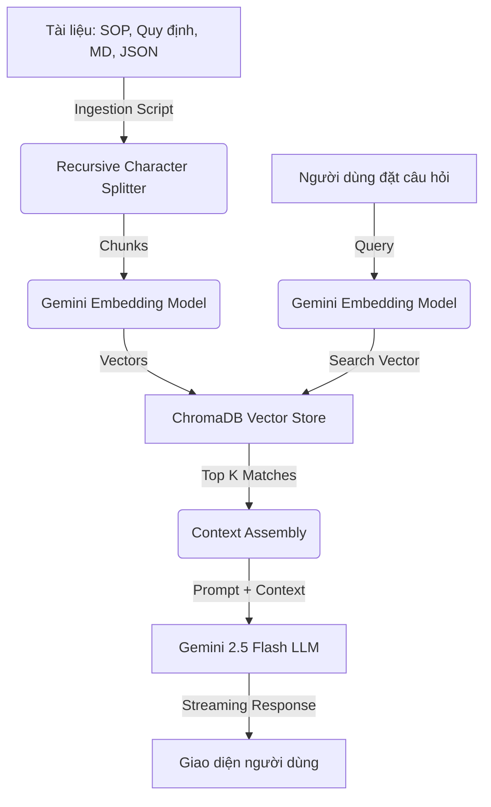

# Samkwang AI Assistant - Hệ thống Chatbot RAG Nội bộ

## 1. Giới thiệu dự án
Samkwang AI Assistant là giải pháp quản trị tri thức doanh nghiệp sử dụng trí tuệ nhân tạo. Hệ thống áp dụng kiến trúc **RAG (Retrieval-Augmented Generation)** để giải quyết vấn đề "ảo giác" của các mô hình AI thông thường, bằng cách bắt buộc AI phải trả lời dựa trên các tài liệu nội bộ đã được phê duyệt của Samkwang Vina.

## 2. Kiến trúc hệ thống (RAG Workflow)



## 3. Danh mục công nghệ chi tiết

| Thành phần | Công nghệ | Chi tiết |
| :--- | :--- | :--- |
| **Giao diện** | Next.js 15, TailwindCSS | App Router, Responsive Design, Samkwang Branding |
| **Ngôn ngữ** | TypeScript | Type-safe, Robust code |
| **LLM Model** | Gemini 2.5 Flash | Tốc độ cao, hỗ trợ Context Window lớn |
| **Embedding** | Gemini Embedding 2 | Vector 3072 chiều, tìm kiếm ngữ nghĩa sâu |
| **Vector Database**| ChromaDB | Lưu trữ cục bộ, bảo mật dữ liệu |
| **Container** | Docker & Compose | Đóng gói môi trường, dễ dàng triển khai |

## 4. Cấu trúc thư mục dự án

```text
├── app/                    # Next.js App Router (Giao diện & API)
│   ├── api/                # Các điểm cuối API (Chat, Upload)
│   ├── layout.tsx          # Cấu hình Layout, Metadata, Favicon
│   └── page.tsx            # Trang chính (Chat Interface)
├── data/
│   └── company/            # Thư mục chứa tài liệu nội bộ (MD, TXT, JSON)
├── lib/                    # Các module lõi
│   ├── chroma.ts           # Quản lý Vector Store & Embeddings
│   └── ingest-manager.ts   # Logic quét và nạp dữ liệu từ thư mục
├── public/                 # Tài nguyên tĩnh (Logo, Images)
├── scripts/                # Các script chạy độc lập (Ingest, Reset)
├── docker-compose.yml      # Cấu hình chạy Docker (Web + ChromaDB)
└── .env.local              # Biến môi trường (API Key, URL)
```

## 5. Cấu hình biến môi trường (.env.local)

Hệ thống yêu cầu các biến sau để hoạt động:

*   `GEMINI_API_KEY`: Key lấy từ Google AI Studio.
*   `CHROMA_URL`: Địa chỉ của ChromaDB container (mặc định: `http://localhost:8001`).
*   `GEMINI_EMBEDDING_MODEL`: Tên model embedding (Khuyên dùng: `gemini-embedding-2`).
*   `GEMINI_CHAT_MODEL`: Tên model chat (Khuyên dùng: `gemini-2.5-flash`).

## 6. Tính năng nổi bật

*   **Tự động hóa nạp liệu:** Không cần upload thủ công. Chỉ cần thả file vào thư mục `data/company` và chạy lệnh nạp.
*   **Phản hồi theo thời gian thực:** Sử dụng cơ chế Streaming giúp người dùng nhận câu trả lời ngay lập tức khi AI đang tạo text.
*   **Tìm kiếm chính xác:** Tự động cắt nhỏ văn bản và lọc bỏ các đoạn trống để tối ưu hóa bộ nhớ vector.
*   **Persistence:** Lịch sử trò chuyện được lưu trữ tại trình duyệt người dùng, đảm bảo trải nghiệm liền mạch.
*   **Bảo mật:** Dữ liệu nội bộ được lưu trữ trong ChromaDB cục bộ, không gửi đi các dịch vụ bên thứ ba (trừ việc tạo vector thông qua API).

## 7. Mở rộng (Advanced)

### Hỗ trợ PDF và DOCX
Hệ thống đã được thiết kế sẵn để mở rộng. Để hỗ trợ các định dạng phức tạp:
1. Cài đặt thêm thư viện: `npm install pdf-parse mammoth`.
2. Cập nhật `lib/ingest-manager.ts` để thêm loader cho các định dạng này.

### Điều chỉnh độ chính xác
Bạn có thể thay đổi `chunkSize` và `chunkOverlap` trong `lib/chroma.ts` để AI lấy được ngữ cảnh rộng hơn hoặc chi tiết hơn tùy theo loại tài liệu.

---
*Bản quyền © 2026 thuộc về Samkwang Vina IT Team.*
